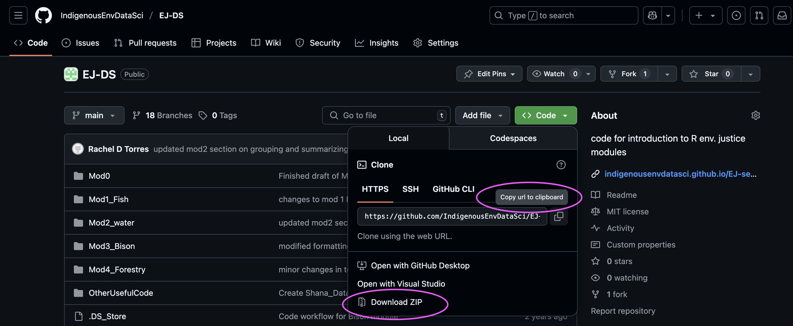

# How to contribute

Thank you for your interest in our project! 
This repository is the result of many collaborations between instructors and students on an open source education resource, and we welcome contributions. 

## Feedback 

We welcome feedback that could be about content, technical issues, or any questions you may have. [Opening an issue](https://github.com/IndigenousEnvDataSci/EJ-DS/issues) will start a conversation with the repository maintainers. 

## Adapting material 

The material is open source and available for you to adapt for your own educational needs. You can do this through a few different ways:

- [Fork the repository](https://docs.github.com/en/pull-requests/collaborating-with-pull-requests/working-with-forks/fork-a-repo) to create a copy of all files that you can then make change sto on your own. 

- Download the repository to your desktop by clicking the zip folder, as shown in this screenshot:

- Start a [project](https://support.posit.co/hc/en-us/articles/200526207-Using-RStudio-Projects) in RStudio. Follow the steps in this [teacher's guide](https://github.com/IndigenousEnvDataSci/EJ-DS/blob/main/Worksheets/Teachers_Guide_Setup.pdf) to use the link to the GitHub repository to start an R Project. 

## Collaborations 

Interested in collaborating on place based modules for your course, or using this material for a workshop? Contact us! You can reach us through this repository by: 
- [Opening an issue](https://github.com/IndigenousEnvDataSci/EJ-DS/issues) with the 'Collaborations' template and tell us more about yourself. 

